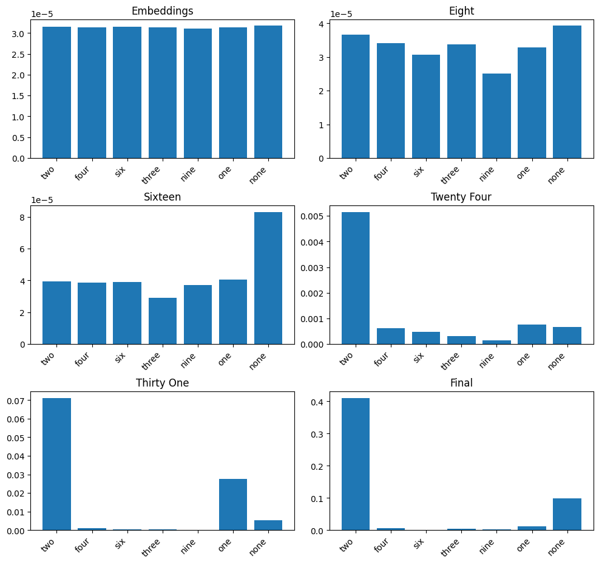
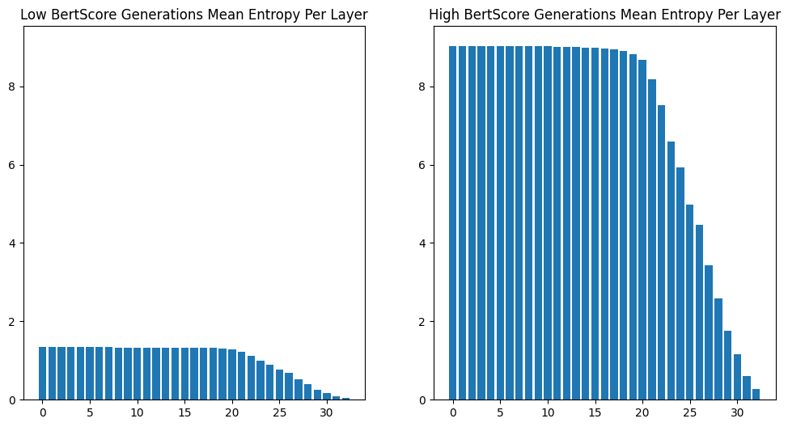

# LLM Early Exit
**An Early Exit strategy Analysis for LLMs**

## Usage
You can install the required dependencies with the following command:
```bash
conda env create -f environment.yml
```

Then activate the environment:
```bash
conda activate torch-main
```

### Early Layer Visualization
run and follow the cells in the `vis.ipynb` file.

an Example visualization of the probability distribution of a wrong answer is:
 - **Question:** How many whiskers does a human have?
 - **Correct Answer** None
 - **Model Generation:** Two



### Entropy Visualization
The entropy of layers based on correct and wrong answers on the TruthfulQA dataset shows potential bias (low entropy) in early layers.

The code can be found in the `Entropy.ipynb` file.



### MLP Fact Detection
We train simple MLPs on the inner layer logits on the true-false dataset in the 'classifier.ipynb` file to try to detect unfactual generations.


Here are some results:

| Experiment               | Train Loss | Train Acc | Test Acc |
|--------------------------|------------|-----------|----------|
| LM Next Token            | -          | 0.0       | 0.0      |
| LM Token Prob.           |            | 0.50      | 0.53     |
| MLP tap at layer 16      | 0.6228     | 0.56      | 0.65     |
| MLP tap at layer 20      | 0.6283     | 0.56      | 0.63     |
| MLP tap at layer 24      | 0.6263     | 0.55      | 0.61     |
| MLP majority             | -          | 0.56      | 0.63     |


### A Potential Solution
We use the DoLa decoding Method to generate new answers. Although the new generations seem better to humans. These automated metrics below seem to not agree. More information can be found at the [Original DoLa Repository](https://github.com/voidism/DoLa).

|                  |     BLEU |    ROUGE |   BERTScore |
|:-----------------|---------:|---------:|------------:|
| Vanilla Decoding | 0.244445 | 0.409804 |    0.900487 |
| Dynamic-DOLA     | 0.16386  | 0.347001 |    0.891913 |